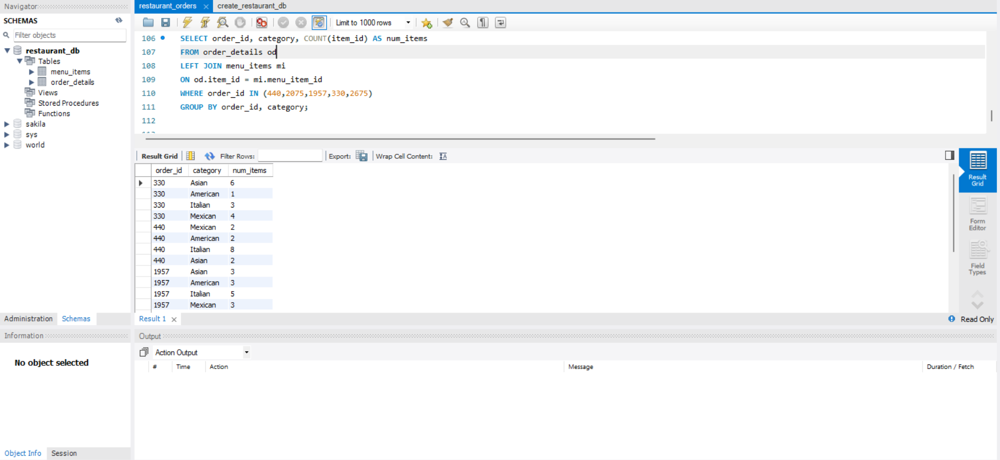

# Restaurant Order Analysis

SQL analysis of restaurant menu and order data using MySQL.

## Objective
Analyze menu pricing, order volume, category performance, and customer purchasing patterns.

## Tools
- MySQL
- MySQL Workbench

## SQL skills used
- SELECT
- WHERE
- COUNT, AVG, MIN, MAX
- GROUP BY
- HAVING
- DISTINCT
- JOINs
- Subqueries

## Files
- `create_restaurant_db.sql` – creates and loads the database
- `restaurant_orders.sql` – contains the analysis queries

## Analysis performed
- Number of menu items
- Menu items by category
- Average price by category
- Order date range
- Number of orders
- Largest orders
- Category composition of high-volume orders

- ## Data Source
Maven Analytics LEGO Sets dataset.
